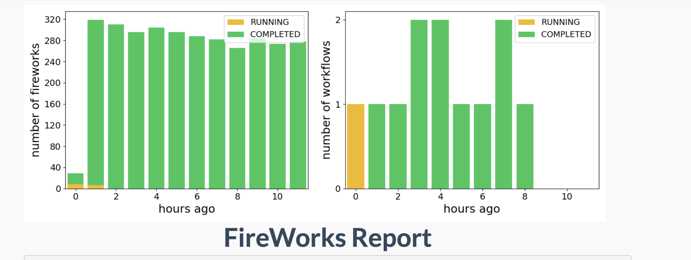

Impulse is an easy-to-deploy all-in-one solution for extremely high-throuput
embarrassingly parallel data extraction built for digitization, indexing,
and distribution through IIIF manifests.

Running on Northwestern University's Quest supercomputing cluster, we observed
hundreds of pages per hour. (This is while limiting ourselves to 50 concurrent
jobs!) This could easily hit thousands of pages per hour.

This code is very easily extensible to new models/paradigms. Just edit the
`auxiliary.surya_on_image` function!

This project would not be possible without the work of other amazing open-
source projects.

- [Fireworks by materialsproject](https://materialsproject.github.io/fireworks/)
- [Surya by DataLab](https://github.com/datalab-to/surya)
